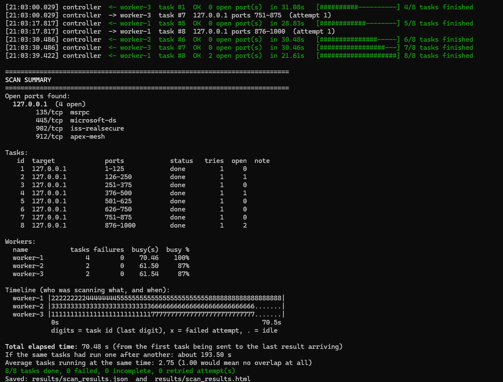
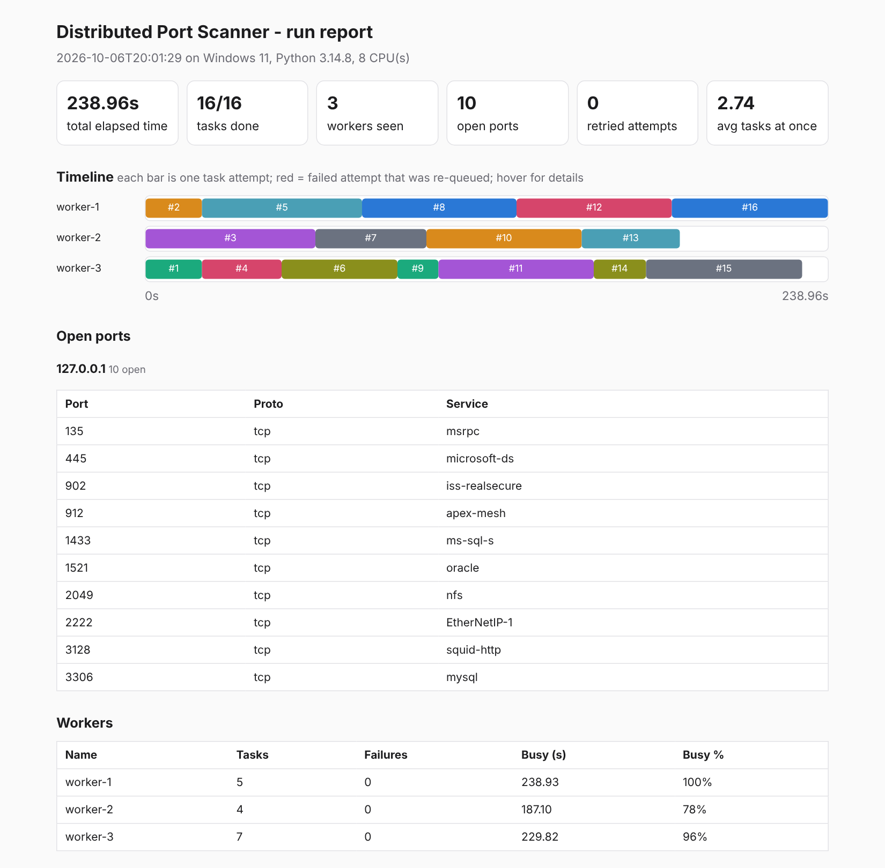
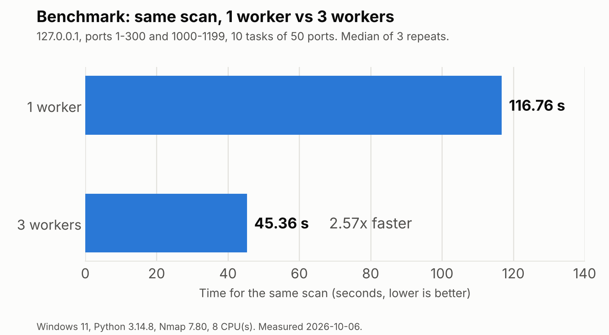
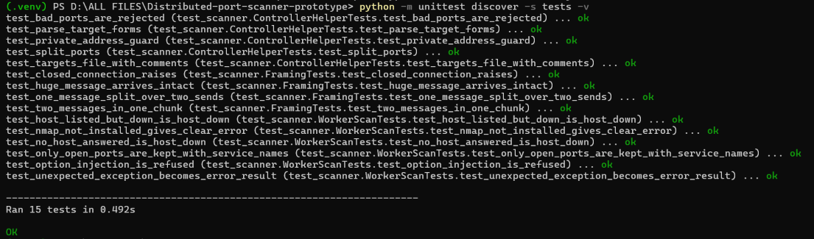

# Distributed Port Scanner

A small **controller/worker** port scanner written in Python. A controller splits a scan into tasks and hands them to any number of worker processes. Each worker runs Nmap on its task and sends back the open ports. Because the controller serves all workers at the same time, scans run **in parallel**, and every run prints a live log, a summary, a timeline of who scanned what, and saves a JSON and an HTML report.

It is a course project (student prototype): readable first, clever second.

> **Responsible use:** only scan machines and networks you own or have explicit, written permission to scan. Port scanning other people's systems can be illegal and can look like an attack. The controller refuses targets that are not localhost or private-network addresses unless you add `--i-have-permission`. That check is a safety reminder, not a security feature.

---

## See it working

A real run on Windows 11: 3 workers share 8 tasks, and the controller prints a summary, a table of tasks, per-worker numbers and an ASCII timeline (each digit is a task id, each dot is idle time).



Every run also writes a self-contained HTML report (below: the demo run with 16 tasks and 3 workers). The coloured timeline shows which worker scanned which ports and when.



## How it works


The conversation between controller and worker (one JSON object per line):

```
worker      -> controller   {"type":"hello","worker":"worker-1"}
controller  -> worker       {"type":"task","task_id":3,"ip":"127.0.0.1","ports":"1001-1500","attempt":1}
worker      -> controller   {"type":"result","task_id":3,"status":"ok","open_ports":[{"host":"127.0.0.1","port":1433,"protocol":"tcp","service":"ms-sql-s"}], ...}
controller  -> worker       {"type":"task", ...}            (next task, same connection)
controller  -> worker       {"type":"no_more_tasks"}        (worker exits)
```

Key ideas, in plain words:

* **Parallel:** the controller starts one thread per worker connection, so a slow worker never makes the others wait. All threads take tasks from one shared, thread-safe queue.
* **No truncated results:** every message ends with a newline, and the receiver keeps reading until it sees one. (TCP is a byte stream, so a single `recv()` can return half a message.)
* **Fault tolerant:** if a worker crashes, disconnects, goes silent, or reports an error, the controller puts its task back on the queue. A retry limit stops a bad task from looping forever.

## Project layout

```
controller/controller.py   the manager: queue, threads, timeouts, reports
worker/worker.py           the scanner: runs Nmap, returns open ports only
demo.py                    one-command local demo (fake services + controller + workers)
benchmark.py               measures 1 vs 2 vs 3 workers on the same job
tests/test_scanner.py      unit tests (no Nmap needed)
targets.example.txt        example targets file
requirements.txt           python-nmap
docs/                      proposal, design, implementation, testing, guide, report
results/                   created at run time: JSON + HTML reports (git-ignored)
```

## Setup (Windows, PowerShell)

1. Install **Python 3.8 or newer** from python.org (tick *Add Python to PATH*).
2. Install **Nmap** from https://nmap.org/download.html and make sure `nmap --version` works in a *new* PowerShell window.
3. In the project folder:

```powershell
python -m venv .venv
.\.venv\Scripts\Activate.ps1        # if blocked: Set-ExecutionPolicy -Scope Process Bypass
pip install -r requirements.txt
```

(On Linux/macOS: `python3 -m venv .venv && source .venv/bin/activate && pip install -r requirements.txt`, plus `nmap` from your package manager.)

## Quick start: watch it work

```powershell
python demo.py
```

This opens a few harmless fake services on `127.0.0.1`, starts a controller and 3 workers, scans ports 1-1800 in chunks, and prints everything live. When it finishes, open `results\demo.html` in your browser for the timeline.

Other demos:

```powershell
python demo.py --workers 1     # same job with one worker: compare the timelines
python demo.py --crash         # worker-2 dies mid-task; the task is re-queued and finished by another worker
python demo.py --hang          # worker-2 stops answering; the controller times out (5 s) and re-queues the task
```

## Running it yourself

Use one PowerShell window for the controller and one per worker.

```powershell
# window 1: controller (waits until 3 workers are connected, then starts the clock)
python controller/controller.py --target 127.0.0.1:1-1000 --chunk-size 125 --min-workers 3

# windows 2, 3, 4: workers
python worker/worker.py --host 127.0.0.1 --port 5055 --name worker-1
python worker/worker.py --host 127.0.0.1 --port 5055 --name worker-2
python worker/worker.py --host 127.0.0.1 --port 5055 --name worker-3
```

Several targets, or a file (one `host ports` per line; `#` starts a comment, see `targets.example.txt`):

```powershell
python controller/controller.py --target 127.0.0.1:20-25 --target 127.0.0.1:80,443,8080
python controller/controller.py --targets-file targets.example.txt --chunk-size 1000
```

Workers on **other machines**: start the controller with `--bind 0.0.0.0` (default is `127.0.0.1`, this computer only) and point each worker at the controller's address with `--host`. There is no authentication or encryption, so do this only on a network you trust.

### Controller options

| Option | Meaning | Default |
|---|---|---|
| `--target HOST[:PORTS]` | what to scan, repeatable | none |
| `--targets-file FILE` | targets, one per line | none |
| `--chunk-size N` | split each target's ports into tasks of N ports | 0 (no split) |
| `--min-workers N` | wait for N workers before starting the clock | 1 |
| `--wait-timeout SEC` | stop waiting for `--min-workers` after SEC | 30 |
| `--task-timeout SEC` | a worker silent for SEC loses its task | 120 |
| `--max-attempts N` | give up on a task after N failed attempts | 3 |
| `--idle-timeout SEC` | give up if no worker is connected for SEC while tasks remain | 60 |
| `--bind ADDR`, `--port N` | where to listen | `127.0.0.1`, 5055 |
| `--output FILE` | JSON report path (an `.html` is written next to it) | `results/scan_results.json` |
| `--no-html`, `--no-color` | switch things off | |
| `--i-have-permission` | allow non-private targets (only if you may scan them) | off |

### Worker options

| Option | Meaning | Default |
|---|---|---|
| `--host`, `--port` | controller address | `127.0.0.1`, 5055 |
| `--name` | name shown in logs | `worker-<pid>` |
| `--nmap-args="..."` | Nmap arguments (use the `=` form) | `-sT -T4 --max-retries 1` |
| `--connect-retries N` | tries to reach the controller (1 s apart) | 10 |

## Example output

Controller window for `--target 127.0.0.1:1-4000 --chunk-size 500 --min-workers 3`, shortened. This was a real run on a Linux test machine; your times and colours will differ. Ports 2024 and 2025 were services already running on that machine, not part of the demo.

```
[19:24:50.391] controller  listening on 127.0.0.1:5055  |  8 task(s) queued  |  waiting for 3 worker(s)
[19:24:50.772] worker-1    connected from 127.0.0.1:53656
[19:24:51.313] controller  START scanning (3 worker(s) connected)
[19:24:51.314] controller  -> worker-2  task #1  127.0.0.1 ports 1-500  (attempt 1)
[19:24:51.325] controller  -> worker-1  task #2  127.0.0.1 ports 501-1000  (attempt 1)
[19:24:51.366] controller  -> worker-3  task #3  127.0.0.1 ports 1001-1500  (attempt 1)
[19:24:51.369] controller  <- worker-2  task #1  OK  0 open port(s)  in 0.06s   [##------------------] 1/8 tasks finished
...
Open ports found:
  127.0.0.1  (8 open)
       1433/tcp  ms-sql-s
       1521/tcp  oracle
       2024/tcp  xinuexpansion4
       2025/tcp  ellpack
       2049/tcp  nfs
       2222/tcp  EtherNetIP-1
       3128/tcp  squid-http
       3306/tcp  mysql

Workers:
  name           tasks failures  busy(s)  busy %
  worker-1           3        0     0.19     93%
  worker-2           3        0     0.17     83%
  worker-3           2        0     0.15     74%

Timeline (who was scanning what, and when):
  worker-1 |...222222222222255555555555555555555555555588888888888888888|
  worker-2 |111111111111111144444444444444444666666666666666666.........|
  worker-3 |...............333333333333333333333333377777777777777777777|
            0s                                                      0.2s
            digits = task id (last digit), x = failed attempt, . = idle

Total elapsed time: 0.20 s (from the first task being sent to the last result arriving)
If the same tasks had run one after another: about 0.52 s
Average tasks running at the same time: 2.51 (1.00 would mean no overlap at all)
8/8 tasks done, 0 failed, 0 incomplete, 0 retried attempt(s)
```

Reading the timeline: each row is a worker, time flows left to right, and a digit is the last digit of the task id being scanned. Rows with digits at the same horizontal position were scanning **at the same moment**. That overlap is the parallelism. An `x` is a failed attempt that was re-queued.

What happens when something goes wrong (all verified by `demo.py --crash`, `demo.py --hang` and the manual scenarios listed in `docs/05_testing_plan.md`):

| Situation | What the system does |
|---|---|
| Host is down or unreachable | worker returns status `host_down` with a clear message; the task counts as finished |
| Nmap missing or crashes on a worker | worker returns status `error`; the controller retries the task (up to `--max-attempts`), then marks it `failed` |
| Worker process dies mid-task | controller sees the closed connection, re-queues the task |
| Worker stops answering | after `--task-timeout` the controller drops it and re-queues the task |
| All workers gone, tasks left | after `--idle-timeout` the controller stops, reports what finished, exits with code 1 |
| Ctrl+C on the controller | reports what finished so far, exits with code 1 |

## Benchmark: is parallel really faster?

```powershell
python benchmark.py                                  # default job: 1 worker vs 3 workers
python benchmark.py --workers 1 2 3                  # add a 2-worker setup
python benchmark.py --ports 1-300 --chunk-size 25    # a smaller, quicker job
```

It runs the **same** job once per worker count (several times, alternating the order), measures the controller's scan time (not process start-up), prints the median of each setup and the speed-up, and prints a ready-to-paste table that includes the environment it ran on. Raw numbers go to `results/benchmark_results.json`.

**Scanning localhost on Windows is much slower than on Linux** (roughly 0.15 s of worker time per port in a real Windows run of the demo, against well under a millisecond per port on the Linux test machine), so the default job is small and a run takes several minutes on Windows. Pick a `--ports` range that fits your patience.

### Measured on Windows 11 (the default job)



`python benchmark.py` on Windows 11 (Python 3.14.8, Nmap 7.80, 8 CPU cores), run on 2026-10-06. Job: `127.0.0.1` ports 1-300 and 1000-1199 (500 ports) in 10 tasks of 50 ports, 3 repeats per setup, median reported. Every run completed 10/10 tasks and found all three expected fake services (plus one real open port of that computer, 4 open ports in total).

| Workers | Median time (s) | Min (s) | Max (s) | Speed-up vs. 1 worker |
|---|---|---|---|---|
| 1 | 116.76 | 114.71 | 118.53 | 1.00x |
| 3 | 45.36 | 45.19 | 45.67 | 2.57x |

Three workers did the same job about 2.6 times faster than one, which is close to the ideal 3x and shows that the workers really run at the same time. The gap to 3x is expected: 10 tasks cannot be divided evenly among 3 workers (one worker has to take 4 tasks while the others take 3, which by itself limits the speed-up to roughly 2.5x for equal-sized tasks), and the controller adds a little overhead. The three repeats of each setup agree within about 3 s, so the result is stable. This was measured scanning the local machine from one computer; it says nothing about scanning a real network or using several physical computers.

### Measured on Linux (a bigger job)

On the Linux test machine used to develop this project (2 CPU cores, Python 3.13, Nmap 7.94), with a much bigger job because Linux scans localhost far faster: `127.0.0.1` ports 1-30000 in 20 tasks of 1500 ports, 5 repeats, median:

| Workers | Median time (s) | Min (s) | Max (s) | Speed-up vs. 1 worker |
|---|---|---|---|---|
| 1 | 1.22 | 1.12 | 1.36 | 1.00x |
| 2 | 0.61 | 0.55 | 0.81 | 1.99x |
| 3 | 0.65 | 0.59 | 0.77 | 1.87x |

Here the third worker did **not** help, because that machine has only 2 cores and, on localhost, the workers and their Nmap processes all compete for those same cores. Scanning your own computer is limited by your CPU; scanning real network targets is mostly *waiting* for replies, so more workers can keep helping there (not measured). Numbers depend on the computer, so **run `python benchmark.py` on your own machine and use your own table** wherever you cite results.

## Tests

```powershell
python -m unittest discover -s tests -v
```

15 unit tests cover message framing (huge, glued and split messages), open-ports-only filtering, host-down and Nmap-missing handling, input validation and target parsing. They use a stand-in for Nmap, so Nmap does not need to be installed to run them.



## Limitations

* **Single controller:** if the controller dies, the run is lost (workers just exit). Results are kept in memory and written at the end.
* **No authentication or encryption.** Anyone who can reach the controller port can connect as a worker, and results travel in plain text. Keep it on localhost or a trusted network. A basic input check stops a task from injecting extra Nmap options, but that is not a substitute for real authentication.
* **TCP connect scans only** (`-sT`; works without administrator rights). No UDP, no OS detection, and service names come from Nmap's port table unless you add `--nmap-args="-sT -sV"` for real version detection (slower).
* **Fixed-size tasks:** a very uneven task can leave other workers idle at the end (visible as dots at the right edge of the timeline). Smaller `--chunk-size` helps. Re-queued tasks go to the back of the queue.
* **The speed-up depends on where the time goes.** On localhost it is capped by your CPU core count (see the benchmark). The report does not claim results for large networks, because none were tested.
* **Platform:** developed and tested on Linux, and also run on Windows 11 with Nmap 7.80. `python demo.py` finished all 16 tasks with 3 workers and an average of 2.74 tasks running at the same time, and `python benchmark.py` measured 116.76 s with 1 worker against 45.36 s with 3 workers (see the benchmark section). The demo run took about 239 s for 4000 ports because scanning localhost is slow on Windows (the sum of the task times was about 656 s, which is an estimate of the one-after-another time, not a measured 1-worker run). The 15 unit tests also pass on Windows 11 (Python 3.14.8).
* **One controller per port:** on Windows the controller asks for exclusive use of its port, so starting a second controller on the same port fails with an error instead of silently sharing it. If you see that error, close the other controller window first.
* The controller's own port (5055) shows up as "open" if you scan a range that includes it on the same machine. That is the controller itself.
